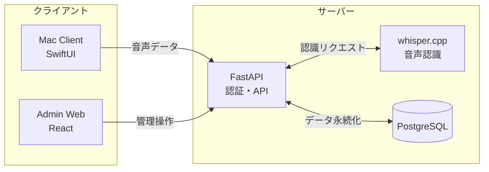

# VoxType

whisper.cpp を使用した音声認識サーバーと Mac クライアントで構成される音声入力システム。

## 概要

- whisper.cpp (large-v3 モデル) による日本語音声認識
- GitHub OAuth による認証と whitelist によるアクセス制御
- Mac メニューバーアプリでホットキー録音、テキスト挿入
- React 管理画面でユーザーと辞書を管理

## システム構成



## ディレクトリ構成

```
voxtype/
├── server/        # FastAPI サーバー
├── whisper/       # whisper.cpp サーバー
├── admin-web/     # React 管理画面
├── client/        # Mac クライアント
└── plan/          # 計画ドキュメント
```

## セットアップ

### 必要環境

- Docker / Docker Compose
- Python 3.11+
- Node.js 18+
- Xcode 15+ (Mac クライアントビルド用)

### 環境変数

| 変数名 | 必須 | 説明 | 例 |
|--------|------|------|-----|
| `DATABASE_URL` | Yes | データベース接続URL | `sqlite+aiosqlite:///./voice.db` |
| `JWT_SECRET` | Yes | JWT署名用シークレットキー | ランダムな文字列 |
| `GITHUB_CLIENT_ID` | Yes | GitHub OAuth App Client ID | `Iv1.xxxxxxxxxx` |
| `GITHUB_CLIENT_SECRET` | Yes | GitHub OAuth App Client Secret | `xxxxxxxxxxxxxxxx` |
| `OPENAI_API_KEY` | No | OpenAI API Key（将来の拡張用） | `sk-xxxxxxxx` |
| `WHISPER_SERVER_URL` | No | whisper.cppサーバーURL | `http://localhost:8080` |
| `APP_NAME` | No | アプリケーション名 | `VoxType` |
| `DEBUG` | No | デバッグモード | `true` / `false` |

### サーバー起動

```bash
# 環境変数を設定
cp .env.example .env
# .env を編集して GitHub OAuth 情報を設定

# コンテナ起動
docker compose up -d

# whisper モデルをダウンロード (初回のみ)
cd whisper/whisper.cpp/models
./download-ggml-model.sh large-v3-q8_0
```

### 開発環境

```bash
# サーバー開発
cd server
uv sync
uv run uvicorn app.main:app --reload

# テスト実行
uv run pytest

# Admin Web開発
cd admin-web
npm install
npm run dev
```

### Mac クライアント

1. GitHub Releases から .app をダウンロード
2. Applications フォルダに配置
3. 初回起動時に「システム設定 > プライバシーとセキュリティ」で許可

## 本番環境デプロイ

### 1. GitHub OAuth アプリ設定

1. [GitHub Developer Settings](https://github.com/settings/developers) で新しい OAuth App を作成
2. Authorization callback URL: `https://api.yourdomain.com/auth/callback`
3. Client ID と Client Secret を `.env` に設定

### 2. SSL証明書の取得

```bash
# certbot で Let's Encrypt 証明書を取得
docker compose -f docker-compose.prod.yml run --rm certbot certonly \
  --webroot --webroot-path=/var/www/certbot \
  -d api.yourdomain.com -d admin.yourdomain.com
```

### 3. 本番環境起動

```bash
# 環境変数を設定
cp .env.example .env
# .env を本番用に編集

# nginx設定のドメインを変更
# nginx/nginx.prod.conf の server_name を実際のドメインに変更

# 本番環境起動
docker compose -f docker-compose.prod.yml up -d
```

### 4. DNS設定

- `api.yourdomain.com` → サーバーIP
- `admin.yourdomain.com` → サーバーIP

## トラブルシューティング

### Mac クライアントが起動しない

1. 「システム設定 > プライバシーとセキュリティ」で「このまま開く」を選択
2. マイクのアクセス許可を確認
3. アクセシビリティ権限を確認（ホットキー機能に必要）

### 認証エラー (403 Forbidden)

- Whitelist に登録されているか確認
- JWT トークンの有効期限（7日間）を確認
- 管理画面からユーザーを再追加

### 音声認識が遅い

- whisper.cpp サーバーが起動しているか確認
- モデルファイル（large-v3-q8_0）がダウンロードされているか確認
- サーバーリソース（CPU/メモリ）を確認

### docker compose up でエラー

```bash
# ログを確認
docker compose logs -f

# コンテナを再ビルド
docker compose build --no-cache
docker compose up -d
```

## ライセンス

このプロジェクトは以下のオープンソースソフトウェアを使用しています。

- [whisper.cpp](https://github.com/ggerganov/whisper.cpp) - MIT License
- [Whisper](https://github.com/openai/whisper) - MIT License
- [FastAPI](https://fastapi.tiangolo.com/) - MIT License
- [SQLAlchemy](https://www.sqlalchemy.org/) - MIT License
- [PostgreSQL](https://www.postgresql.org/) - PostgreSQL License
- [Authlib](https://authlib.org/) - BSD-3-Clause License
- [React](https://reactjs.org/) - MIT License
- [shadcn/ui](https://ui.shadcn.com/) - MIT License
- [Tailwind CSS](https://tailwindcss.com/) - MIT License
